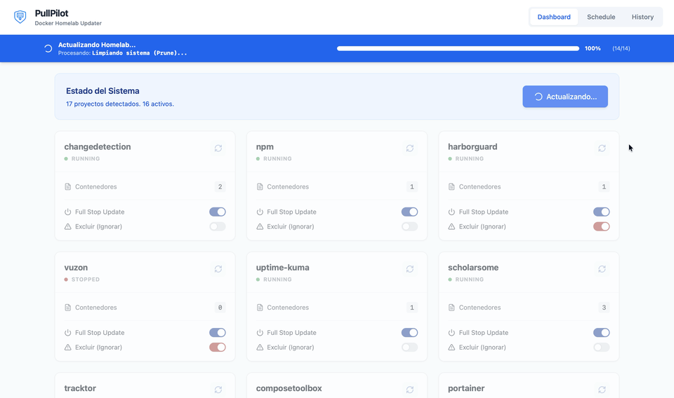

<p align="center">
  
</p>

<div align="center">

<h3>
  <a href="#english">English</a> | <a href="#español">Español</a>
</h3>

<p align="center">
  <a href="https://github.com/Kernel-Nomad/PullPilot/stargazers">
    
  </a>
  &nbsp;
  <a href="https://github.com/Kernel-Nomad/PullPilot/issues">
    
  </a>
  &nbsp;
  <a href="./LICENSE">
    
  </a>
  &nbsp;
  
</p>

<p align="center">
  
  &nbsp;
  
  &nbsp;
  
</p>

</div>

<p align="center">
  
</p>


---

<a name="english"></a>
# PullPilot

App to manage updates for your docker images and services (monitor status, view logs, and control deployment modes). All from a clean and responsive visual interface.

## Quick Installation (Docker Compose)

The recommended way to deploy PullPilot is using Docker Compose.

### 1. Required Directory Structure

PullPilot expects your projects to be organized in subfolders within a root folder on your server:


```

/home/user/docker/    <-- This is the folder you will mount
├── plex/
│   └── docker-compose.yml
├── pihole/
│   └── docker-compose.yml
└── ...

```

> :warning: Auto-exclusion Logic: Even if placed inside the root folder, the application is hardcoded to automatically ignore folders named: pullpilot, pullpilot-ui, docker-updater, and data.

#### Suggested structure:


```

/home/user/
├── my_projects/         <-- Root folder monitored by PullPilot
│   ├── plex/
│   │   └── docker-compose.yml
│   ├── pihole/
│   │   └── docker-compose.yml
│   └── ...
│
└── pullpilot/           <-- PullPilot installation folder (OUTSIDE the previous one)
└── docker-compose.yml

```

### 2. Prepare the environment

Create a folder for PullPilot and inside it create a `.env` file with the path to your projects:

```bash
DOCKER_ROOT_PATH=  # Ex: /home/user/docker
TZ=Europe/Madrid

AUTH_USER=admin
AUTH_PASS=your_secure_password

# PULLPILOT_PORT=8000

```

### 3. docker-compose.yml

Create a `docker-compose.yml` file for PullPilot:

```yaml
services:
  pullpilot:
    container_name: pullpilot
    image: ghcr.io/kernel-nomad/pullpilot
    restart: unless-stopped
    env_file:
      - .env
    ports:
      - "${PULLPILOT_PORT:-8000}:8000"
    volumes:
      - /var/run/docker.sock:/var/run/docker.sock
      - pullpilot_data:/app/data
      - ${DOCKER_ROOT_PATH}:/app/projects
      - ./sessions:/app/sessions
    environment:
      - TZ=${TZ}

volumes:
  pullpilot_data:

```

### 4. Start

```bash
docker compose up -d

```

Access the web interface at: [http://your-server-ip:8000](https://www.google.com/search?q=http://your-server-ip:8000)

## Usage Guide

### The Dashboard

Upon entering, you will see cards for each detected project:

* **Status:** The green dot indicates that all containers in the `docker-compose.yml` are running.
* **Update Button (Individual):** Forces a check and update only for that project.
* **Switches:**
* *Full Stop:* Enable if the service needs to be completely stopped to update.
* *Exclude:* Enable to protect the project from mass updates.


### Global Update

The **"Update All"** button in the header triggers the background process:

1. Scans all non-excluded projects.
2. Executes `git pull` (images).
3. Applies updates (recreates containers).
4. Generates a report in the History tab.

### Automatic Scheduling

By default, PullPilot runs a global update every day at 04:00 AM (container time).

## Local Development

If you want to contribute or modify the code:

1. Clone the repo:
```bash
git clone [https://github.com/Kernel-Nomad/PullPilot](https://github.com/Kernel-Nomad/PullPilot)
cd pullpilot

```


2. Build and start. The project includes a multi-stage Dockerfile that compiles the frontend (React) and prepares the backend (Python):
```bash
docker compose up --build

```


## ⚠️ Important Notes

* **Volumes:** Make sure the path `/projects_root` inside the container correctly points to where you have your `docker-compose.yml` files on the host.
* **Security:** PullPilot has access to the Docker socket. Do not expose port 8000 directly to the internet without an additional security layer (like Authelia, Authentik, or Basic Auth in a Reverse Proxy).

---

<a name="español"></a>

# PullPilot

App para gestionar actualizaciones de tus imágenes y servicios docker (además de visualizar el estado, logs y controlar el modo de despliegue). Todo desde una interfaz visual limpia y responsiva.

## Instalación Rápida (Docker Compose)

La forma recomendada de desplegar PullPilot es usando Docker Compose.

### 1. Estructura de directorios requerida

PullPilot espera que tus proyectos estén organizados en subcarpetas dentro de una carpeta raíz en tu servidor:

```
/home/usuario/docker/    <-- ESTA es la carpeta que montarás
├── plex/
│   └── docker-compose.yml
├── pihole/
│   └── docker-compose.yml
└── ...

```

> :warning: Lógica de auto-exclusión: Incluso si se colocan dentro de la carpeta raíz, la aplicación está programada para ignorar automáticamente las carpetas con los nombres: pullpilot, pullpilot-ui, docker-updater y data.

#### Estructura sugerida:

```
/home/usuario/
├── mis_proyectos/       <-- Carpeta raíz que monitoreará PullPilot
│   ├── plex/
│   │   └── docker-compose.yml
│   ├── pihole/
│   │   └── docker-compose.yml
│   └── ...
│
└── pullpilot/           <-- Carpeta de instalación de PullPilot (FUERA de la anterior)
    └── docker-compose.yml

```

### 2. Prepara el entorno

Crea una carpeta para PullPilot y dentro crea un archivo `.env` con la ruta de tus proyectos:

```bash
DOCKER_ROOT_PATH=  # Ej: /home/usuario/docker
TZ=Europe/Madrid

AUTH_USER=admin
AUTH_PASS=tu_password_segura

# PULLPILOT_PORT=8000

```

### 3. docker-compose.yml

Crea un archivo `docker-compose.yml` para PullPilot:

```yaml
services:
  pullpilot:
    container_name: pullpilot
    image: ghcr.io/kernel-nomad/pullpilot
    restart: unless-stopped
    env_file:
      - .env
    ports:
      - "${PULLPILOT_PORT:-8000}:8000"
    volumes:
      - /var/run/docker.sock:/var/run/docker.sock
      - pullpilot_data:/app/data
      - ${DOCKER_ROOT_PATH}:/app/projects
      - ./sessions:/app/sessions
    environment:
      - TZ=${TZ}

volumes:
  pullpilot_data:

```

### 4. Iniciar

```bash
docker compose up -d

```

Accede a la interfaz web en: [http://tu-servidor-ip:8000](https://www.google.com/search?q=http://tu-servidor-ip:8000)

## Guía de Uso

### El Dashboard

Al entrar, verás tarjetas para cada proyecto detectado:

* **Estado:** El punto verde indica que todos los contenedores del `docker-compose.yml` están running.
* **Botón Actualizar (Individual):** Fuerza la comprobación y actualización solo de ese proyecto.
* **Switches:**
* *Full Stop:* Actívalo si el servicio necesita bajarse completamente para actualizarse.
* *Excluir:* Actívalo para proteger el proyecto de actualizaciones masivas.


### Actualización Global

El botón **"Actualizar Todo"** en la cabecera desencadena el proceso en segundo plano:

1. Escanea todos los proyectos no excluidos.
2. Ejecuta `git pull` (imágenes).
3. Aplica actualizaciones (recrea contenedores).
4. Genera un reporte en la pestaña Historial.

### Programación Automática

Por defecto, PullPilot ejecuta una actualización global todos los días a las 04:00 AM (hora del contenedor).

## Desarrollo Local

Si quieres contribuir o modificar el código:

1. Clona el repo:
```bash
git clone [https://github.com/Kernel-Nomad/PullPilot](https://github.com/Kernel-Nomad/PullPilot)
cd pullpilot

```


2. Construye y levanta. El proyecto incluye un Dockerfile multi-stage que compila el frontend (React) y prepara el backend (Python):
```bash
docker compose up --build

```


## ⚠️ Notas Importantes

* **Volúmenes:** Asegúrate de que la ruta `/projects_root` dentro del contenedor apunte correctamente a donde tienes tus `docker-compose.yml` en el host.
* **Seguridad:** PullPilot tiene acceso al socket de Docker. No expongas el puerto 8000 directamente a internet sin una capa de seguridad adicional (como Authelia, Authentik o Basic Auth en un Reverse Proxy).
