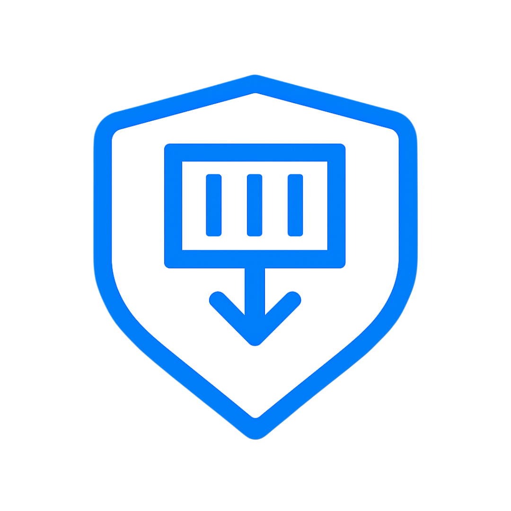
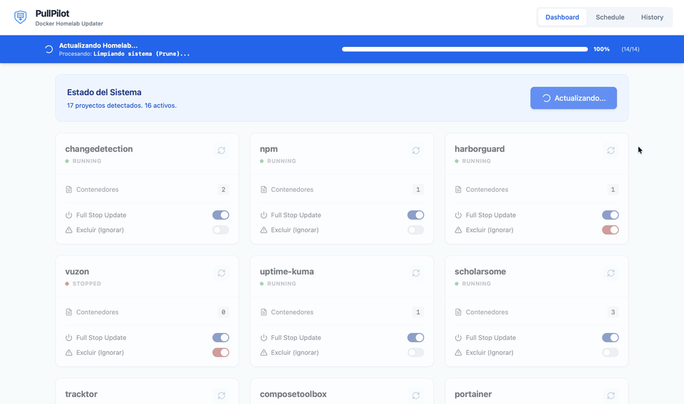

<p align="center">
  
</p>

<div align="center">

<h3>
  <a href="#english">English</a> | <a href="#español">Español</a>
</h3>

<p align="center">
  <a href="https://github.com/Kernel-Nomad/PullPilot/stargazers">
    
  </a>
  &nbsp;
  <a href="https://github.com/Kernel-Nomad/PullPilot/issues">
    
  </a>
  &nbsp;
  <a href="./LICENSE">
    
  </a>
  &nbsp;
  
</p>

<p align="center">
  
  &nbsp;
  
  &nbsp;
  
</p>

</div>

<p align="center">
  
</p>


---

<a name="english"></a>
# PullPilot

App to manage updates for your docker images and services (monitor status, view logs, and control deployment modes). All from a clean and responsive visual interface.

This repository is for **source code**, **issues**, and **releases**. The recommended way to run PullPilot is to place the official `docker-compose.yml` and a `.env` file on your server **without cloning** the repo. Each stable [GitHub release](https://github.com/Kernel-Nomad/PullPilot/releases) publishes the image to GHCR as `ghcr.io/kernel-nomad/pullpilot:latest` and semver tags (for example `1.2.3`). The default compose file uses `:latest`; edit the `image:` line to pin a version. To upgrade when pinned, bump the tag and run `docker compose pull && docker compose up -d`. The same `docker-compose.yml` and `.env.example` are also attached as **release assets** when you prefer downloading from the Releases page instead of `raw.githubusercontent.com`.

## Quick start (without cloning the repository)

Use a dedicated folder for PullPilot (outside the directory tree that holds your stacks). Replace `main` with another branch name if you use one.

```bash
mkdir -p ~/pullpilot && cd ~/pullpilot
curl -fsSL -o docker-compose.yml https://raw.githubusercontent.com/Kernel-Nomad/PullPilot/main/docker-compose.yml
curl -fsSL -o .env.example https://raw.githubusercontent.com/Kernel-Nomad/PullPilot/main/.env.example
cp .env.example .env
```

Edit `.env` and set at least `DOCKER_ROOT_PATH`, `TZ`, `AUTH_USER`, `AUTH_PASS`, and `SESSION_SECRET`. The directory at `DOCKER_ROOT_PATH` must **already exist on the host** before the first `docker compose up -d`. If you change `.env` later, run `docker compose up -d` again (or `docker compose restart`) so the container reloads the environment. To generate a stable `SESSION_SECRET`:

```bash
openssl rand -hex 32
```

Start:

```bash
docker compose up -d
```

Open the UI at [http://your-server-ip:8000](http://your-server-ip:8000) (or the host port from `PULLPILOT_PORT`).

If you cloned the repo for development, you can use [`docker-compose.yml`](./docker-compose.yml) and [`.env.example`](./.env.example) from the tree instead of downloading them.

### Directory layout for your stacks

PullPilot expects your projects in subfolders under one root on the server:

```

/home/user/docker/    <-- This is the folder you will mount
├── plex/
│   └── docker-compose.yml
├── pihole/
│   └── docker-compose.yml
└── ...

```

> :warning: Auto-exclusion: folders named `pullpilot`, `pullpilot-ui`, `docker-updater`, and `data` are ignored even if they sit under the root.

Suggested layout (PullPilot config **outside** the monitored tree):

```

/home/user/
├── my_projects/         <-- Root monitored by PullPilot
│   ├── plex/
│   │   └── docker-compose.yml
│   └── ...
└── pullpilot/           <-- PullPilot folder (compose + .env only)
    ├── docker-compose.yml
    └── .env

```

### Environment variables (.env)

**Minimum** for a typical deployment:

```bash
DOCKER_ROOT_PATH=/home/user/docker
TZ=Europe/Madrid

AUTH_USER=admin
AUTH_PASS=your_secure_password
SESSION_SECRET=your-long-random-string
```

The compose file bind-mounts `${DOCKER_ROOT_PATH}` at the **same absolute path** inside the container; the app scans that path for subfolders containing `docker-compose.yml` or `docker-compose.yaml`. Override with `PROJECTS_ROOT` in `.env` only if the in-container path must differ from `DOCKER_ROOT_PATH`.

If `SESSION_SECRET` is omitted, a new secret is generated on every boot and users must sign in again. Optional: **`PULLPILOT_PORT`** (default `8000`). `DATA_DIR` defaults to `/app/data` and is covered by the `pullpilot_data` volume in the official compose; you normally do not set it.

#### Optional / advanced

```bash
SESSION_HTTPS_ONLY=true
# CORS_ORIGINS=https://pullpilot.example.com

# Login rate limit (in-memory, per IP); single uvicorn worker recommended
# LOGIN_RATE_LIMIT_ENABLED=true
# LOGIN_RATE_LIMIT_MAX=15
# LOGIN_RATE_LIMIT_WINDOW_SEC=300

# HEALTHCHECK_TIMEOUT=60
# COMMAND_TIMEOUT=300

# TRUST_X_FORWARDED_FOR=true   # only behind a trusted reverse proxy
```

## Usage Guide

### The Dashboard

Upon entering, you will see cards for each detected project:

* **Status:** The green dot indicates that all containers in the `docker-compose.yml` are running.
* **Update Button (Individual):** Forces a check and update only for that project.
* **Switches:**
* *Full Stop:* Enable if the service needs to be completely stopped to update.
* *Exclude:* Enable to protect the project from mass updates.


### Global Update

The **"Update All"** button in the header triggers the background process:

1. Scans all non-excluded projects.
2. Executes `git pull` (images).
3. Applies updates (recreates containers).
4. Generates a report in the History tab.

### Automatic Scheduling

By default, PullPilot runs a global update every day at 04:00 AM (container time).

## Local development (contributors only)

The sections above are for running PullPilot in production. Use this only if you want to change the code or build the image yourself:

1. Clone the repository:
```bash
git clone https://github.com/Kernel-Nomad/PullPilot
cd PullPilot
```

2. Build and run with the multi-stage Dockerfile (React build + FastAPI):
```bash
docker compose up --build
```

For day-to-day backend/frontend development, see the `Makefile` targets in the repository (`make dev-server`, `make dev-web`).

## ⚠️ Important Notes

* **Docker image:** Prefer the versioned `docker-compose.yml` from this repo (via `curl` or git). The default `image: …:latest` tracks the latest **stable** release on GHCR after you publish a non-prerelease release.
* **Volumes:** Mount your stacks root with `${DOCKER_ROOT_PATH}:${DOCKER_ROOT_PATH}` so host and container share the same absolute path; that is where PullPilot looks for project folders. Override with env `PROJECTS_ROOT` only if you must use a different path inside the container.
* **Security:** PullPilot has access to the Docker socket. Do not expose port 8000 directly to the internet without an additional security layer (like Authelia, Authentik, or Basic Auth in a Reverse Proxy).
* **SESSION_SECRET:** Set a long, fixed random value in `.env` for real deployments. If it is unset, a new secret is generated on every process start and all sessions are invalidated on restart.
* **Project paths:** Each project scan (for example when loading the dashboard via `GET /api/projects`) reconciles the stored path in the database with the current `PROJECTS_ROOT` folder layout.
* **Process model:** Run a **single** API worker process per instance. The scheduler (APScheduler) and login rate limit store state in memory; multiple workers would not share jobs or rate-limit counters consistently.
* **Authentication:** Login is enabled only when **both** `AUTH_USER` and `AUTH_PASS` are set. If you set only one of them, the UI stays open without authentication.
* **Proxy IP:** With `TRUST_X_FORWARDED_FOR=true`, the first address in `X-Forwarded-For` is used for login rate limiting. Enable this only if a trusted proxy controls that header end-to-end (otherwise clients can spoof IPs and bypass limits).

---

<a name="español"></a>

# PullPilot

App para gestionar actualizaciones de tus imágenes y servicios docker (además de visualizar el estado, logs y controlar el modo de despliegue). Todo desde una interfaz visual limpia y responsiva.

Este repositorio sirve para el **código fuente**, **incidencias** y **releases**. La forma recomendada de usar PullPilot es copiar el `docker-compose.yml` oficial y un `.env` en tu servidor **sin clonar** el repo. Cada [release estable en GitHub](https://github.com/Kernel-Nomad/PullPilot/releases) publica la imagen en GHCR como `ghcr.io/kernel-nomad/pullpilot:latest` y tags semver (por ejemplo `1.2.3`). El compose por defecto usa `:latest`; cambia la línea `image:` para fijar versión. Para actualizar con versión fija, sube el tag y ejecuta `docker compose pull && docker compose up -d`. Los mismos `docker-compose.yml` y `.env.example` se adjuntan como **assets del release** si prefieres descargarlos desde la pestaña Releases en lugar de `raw.githubusercontent.com`.

## Inicio rápido (sin clonar el repositorio)

Usa una carpeta dedicada para PullPilot (fuera del árbol donde guardas tus stacks). Cambia `main` por otra rama si la usas.

```bash
mkdir -p ~/pullpilot && cd ~/pullpilot
curl -fsSL -o docker-compose.yml https://raw.githubusercontent.com/Kernel-Nomad/PullPilot/main/docker-compose.yml
curl -fsSL -o .env.example https://raw.githubusercontent.com/Kernel-Nomad/PullPilot/main/.env.example
cp .env.example .env
```

Edita `.env` con al menos `DOCKER_ROOT_PATH`, `TZ`, `AUTH_USER`, `AUTH_PASS` y `SESSION_SECRET`. La carpeta indicada en `DOCKER_ROOT_PATH` debe **existir ya en el host** antes del primer `docker compose up -d`. Si más tarde cambias `.env`, vuelve a ejecutar `docker compose up -d` (o `docker compose restart`) para que el contenedor recargue el entorno. Para generar un `SESSION_SECRET` estable:

```bash
openssl rand -hex 32
```

Inicio:

```bash
docker compose up -d
```

Abre la interfaz en [http://tu-servidor-ip:8000](http://tu-servidor-ip:8000) (o el puerto del host definido en `PULLPILOT_PORT`).

Si clonaste el repo para desarrollo, puedes usar [`docker-compose.yml`](./docker-compose.yml) y [`.env.example`](./.env.example) del árbol en lugar de descargarlos.

### Estructura de directorios para tus stacks

PullPilot espera proyectos en subcarpetas bajo una raíz en el servidor:

```
/home/usuario/docker/    <-- Carpeta que montarás
├── plex/
│   └── docker-compose.yml
├── pihole/
│   └── docker-compose.yml
└── ...

```

> :warning: Auto-exclusión: se ignoran carpetas llamadas `pullpilot`, `pullpilot-ui`, `docker-updater` y `data` aunque estén bajo la raíz.

Estructura sugerida (config de PullPilot **fuera** del árbol monitorizado):

```
/home/usuario/
├── mis_proyectos/       <-- Raíz que monitorea PullPilot
│   ├── plex/
│   │   └── docker-compose.yml
│   └── ...
└── pullpilot/           <-- Solo compose + .env
    ├── docker-compose.yml
    └── .env

```

### Variables de entorno (.env)

**Mínimo** para un despliegue habitual:

```bash
DOCKER_ROOT_PATH=/home/usuario/docker
TZ=Europe/Madrid

AUTH_USER=admin
AUTH_PASS=tu_password_segura
SESSION_SECRET=tu-cadena-larga-aleatoria
```

El compose monta `${DOCKER_ROOT_PATH}` en la **misma ruta absoluta** dentro del contenedor; la app busca ahí subcarpetas con `docker-compose.yml` o `docker-compose.yaml`. Usa `PROJECTS_ROOT` en `.env` solo si la ruta dentro del contenedor debe diferir de `DOCKER_ROOT_PATH`.

Si omites `SESSION_SECRET`, en cada arranque se genera un secreto nuevo y habrá que volver a iniciar sesión. Opcional: **`PULLPILOT_PORT`** (por defecto `8000`). `DATA_DIR` por defecto es `/app/data` y el volumen `pullpilot_data` del compose oficial ya lo cubre; normalmente no hace falta definirlo.

#### Opcional / avanzado

```bash
SESSION_HTTPS_ONLY=true
# CORS_ORIGINS=https://pullpilot.ejemplo.com

# Rate limit de login (en memoria, por IP); recomendable un solo worker uvicorn
# LOGIN_RATE_LIMIT_ENABLED=true
# LOGIN_RATE_LIMIT_MAX=15
# LOGIN_RATE_LIMIT_WINDOW_SEC=300

# HEALTHCHECK_TIMEOUT=60
# COMMAND_TIMEOUT=300

# TRUST_X_FORWARDED_FOR=true   # solo tras reverse proxy de confianza
```

## Guía de Uso

### El Dashboard

Al entrar, verás tarjetas para cada proyecto detectado:

* **Estado:** El punto verde indica que todos los contenedores del `docker-compose.yml` están running.
* **Botón Actualizar (Individual):** Fuerza la comprobación y actualización solo de ese proyecto.
* **Switches:**
* *Full Stop:* Actívalo si el servicio necesita bajarse completamente para actualizarse.
* *Excluir:* Actívalo para proteger el proyecto de actualizaciones masivas.


### Actualización Global

El botón **"Actualizar Todo"** en la cabecera desencadena el proceso en segundo plano:

1. Escanea todos los proyectos no excluidos.
2. Ejecuta `git pull` (imágenes).
3. Aplica actualizaciones (recrea contenedores).
4. Genera un reporte en la pestaña Historial.

### Programación Automática

Por defecto, PullPilot ejecuta una actualización global todos los días a las 04:00 AM (hora del contenedor).

## Desarrollo local (solo contribuidores)

Las secciones anteriores son para ejecutar PullPilot en producción. Usa esto solo si quieres modificar el código o construir la imagen tú mismo:

1. Clona el repositorio:
```bash
git clone https://github.com/Kernel-Nomad/PullPilot
cd PullPilot
```

2. Construye y levanta con el Dockerfile multi-stage (frontend React + backend Python):
```bash
docker compose up --build
```

Para desarrollo diario del backend o frontend, usa los objetivos del `Makefile` del repo (`make dev-server`, `make dev-web`).

## ⚠️ Notas Importantes

* **Imagen Docker:** Usa el `docker-compose.yml` versionado de este repo (vía `curl` o git). La línea `image: …:latest` apunta a la última release **estable** en GHCR tras publicar un release que no sea prerelease.
* **Volúmenes:** Monta la carpeta de stacks con `${DOCKER_ROOT_PATH}:${DOCKER_ROOT_PATH}` para que host y contenedor compartan la misma ruta absoluta; ahí busca PullPilot las carpetas de proyecto. Usa la variable de entorno `PROJECTS_ROOT` solo si necesitas otra ruta dentro del contenedor.
* **Seguridad:** PullPilot tiene acceso al socket de Docker. No expongas el puerto 8000 directamente a internet sin una capa de seguridad adicional (como Authelia, Authentik o Basic Auth en un Reverse Proxy).
* **SESSION_SECRET:** En despliegue real define en `.env` un valor aleatorio largo y fijo. Si no se define, cada arranque del proceso genera un secreto nuevo y las sesiones caducan al reiniciar.
* **Rutas de proyectos:** Cada escaneo (por ejemplo al cargar el dashboard con `GET /api/projects`) actualiza en la base de datos la ruta almacenada si cambió `PROJECTS_ROOT` o la carpeta del proyecto.
* **Proceso único:** Usa **un solo** proceso worker de la API por instancia. El programador (APScheduler) y el rate limit de login guardan estado en memoria; varios workers no compartirían tareas ni contadores de forma coherente.
* **Autenticación:** El login solo se activa si están definidos **los dos**, `AUTH_USER` y `AUTH_PASS`. Si solo configuras uno, la interfaz queda sin autenticación.
* **IP tras proxy:** Con `TRUST_X_FORWARDED_FOR=true` se usa la primera dirección de `X-Forwarded-For` para el rate limit de login. Actívalo solo si un proxy de confianza controla esa cabecera de extremo a extremo; si no, un cliente podría falsear la IP y el límite pierde sentido.
